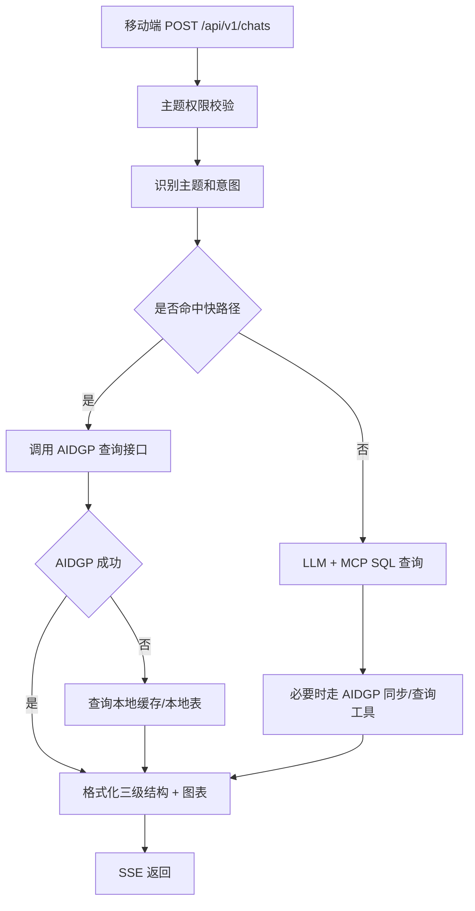

# AIDGP 对接文档（项目开发使用）

适用对象：ChatDB 后端开发、测试、运维  
目标：让问数功能在网格、人流、车流主题下可以按需查询 AIDGP 平台，并将必要数据同步或缓存到本地，满足移动端上线验收。

## 1. 当前项目接入点

现有代码位置：

- AIDGP 客户端接口：`internal/logic/aidgp/client.go`
- AIDGP 配置：`config/config.yaml` -> `qa.sync.aidgp`
- 管理端同步入口：`api/admin/v1/admin.go`、`internal/controller/admin/admin_v1.go`
- 问答/问数同步入口：`api/qa/v1/qa.go`、`internal/controller/qa/qa_v1.go`
- 车流本地模型：`internal/logic/traffic/*`、`internal/model/traffic.go`
- 问数主入口：`POST /api/v1/chats`

必须先替换：

```go
func NewClient(cfg Config) Client {
    return &MockClient{Provider: normalizeProvider(cfg.Provider)}
}
```

上线实现应改为：

- `provider=local`：不调用 AIDGP。
- `provider=mock`：仅测试使用。
- `provider=aidgp`：使用真实 HTTP 客户端。

## 2. 配置项

建议配置：

```yaml
qa:
  sync:
    provider: "aidgp"
    aidgp:
      baseUrl: "https://aidgp.example.com"
      appKey: "${AIDGP_APP_KEY}"
      appSecret: "${AIDGP_APP_SECRET}"
      tokenPath: "/openapi/oauth/token"
      timeoutSeconds: 10
      retryTimes: 2
      tokenExpireSkewSeconds: 120
```

环境变量建议：

```bash
CHATDB_QA_SYNC_PROVIDER=aidgp
CHATDB_AIDGP_BASE_URL=https://aidgp.example.com
CHATDB_AIDGP_APP_KEY=***
CHATDB_AIDGP_APP_SECRET=***
```

安全要求：

- 不允许把真实 `appSecret`、token、数据库密码提交到 Git。
- 当前 `config/config.yaml` 中的明文 AI key 必须迁移到环境变量，并轮换已暴露密钥。
- token 只存内存缓存或 Redis，不入业务日志。

## 3. Token 获取与缓存

### 3.1 获取 token

推荐请求：

```http
POST /openapi/oauth/token
Content-Type: application/json

{
  "appKey": "CHATDB_APP_KEY",
  "appSecret": "CHATDB_APP_SECRET",
  "grantType": "client_credentials"
}
```

推荐响应：

```json
{
  "code": 0,
  "message": "success",
  "data": {
    "accessToken": "eyJ...",
    "tokenType": "Bearer",
    "expiresIn": 7200
  }
}
```

项目处理规则：

- 缓存 key：`aidgp:token:{appKey}`。
- 缓存 TTL：`expiresIn - tokenExpireSkewSeconds`。
- 任一业务请求收到 401/403 且错误码表示 token 过期时，清理 token 并重试一次。
- 并发刷新需要 singleflight，避免多个请求同时刷新 token。

### 3.2 统一请求头

```http
Authorization: Bearer {accessToken}
X-App-Key: {appKey}
X-Request-Id: {uuid}
X-Timestamp: {unix_ms}
Content-Type: application/json
```

如 AIDGP 要求签名，建议新增：

```http
X-Signature: HMAC-SHA256(appSecret, method + "\n" + path + "\n" + timestamp + "\n" + bodySha256)
```

签名算法以对接方最终文档为准。

## 4. 需要实现的客户端接口

在 `internal/logic/aidgp/client.go` 中新增真实客户端：

```go
type HttpClient struct {
    cfg Config
    httpClient *http.Client
    tokenCache TokenCache
}
```

必须实现：

- `GetToken(ctx) (string, error)`
- `QueryGridData(ctx, req GridQuery) (*GridQueryResult, error)`
- `QueryTrafficData(ctx, req TrafficQuery) (*TrafficQueryResult, error)`
- `QueryPopulationData(ctx, req PopulationQuery) (*PopulationQueryResult, error)`
- `SyncKnowledgeBases(ctx, scope SyncScope) (SyncResult, error)`
- `SyncDocuments(ctx, scope SyncScope) (SyncResult, error)`
- `SyncPermissions(ctx, scope SyncScope) (SyncResult, error)`
- `SyncGridData(ctx, scope SyncScope) (SyncResult, error)`
- `SyncTrafficData(ctx, scope SyncScope) (SyncResult, error)`
- `SyncPopulationData(ctx, scope SyncScope) (SyncResult, error)`

## 5. 问数实时查询路径

推荐先落地“查询优先，本地缓存兜底”的路径：



开发策略：

- 对车流、人流、网格高频问法走快路径，直接调用 AIDGP 或本地聚合表。
- 对复杂问法先用本地表支撑，AIDGP 同步任务保证本地数据新鲜。
- AIDGP 不稳定时返回明确降级说明，不能编造数据。

## 6. 网格数据对接

### 6.1 实时查询

用途：重大案件、案件量、结案率、排名、趋势、时段分布。

建议请求：

```http
POST /openapi/chatdb/grid/query
Authorization: Bearer {token}

{
  "requestId": "uuid",
  "metric": "case_count|close_rate|major_case|ranking|trend|time_distribution",
  "dateFrom": "2026-04-01",
  "dateTo": "2026-04-30",
  "region": "高新区",
  "gridName": "",
  "caseType": "",
  "groupBy": "region|community|grid|caseType|day|hour",
  "page": 1,
  "pageSize": 100
}
```

本地映射建议：

- 同步到 `case_list`：保留当前上传能力兼容。
- 新增 `grid_case_metric_daily`：支撑高频指标。
- 新增 `grid_case_import_batch` 或复用 `admin_grid_import`：记录同步批次。

### 6.2 必需字段

- `caseId` / `caseNumber`
- `caseName`
- `caseType1`
- `caseType2`
- `source`
- `region`
- `street`
- `community`
- `gridName`
- `responsibilityUnit`
- `reportTime`
- `closeTime`
- `status`
- `pendingStep`
- `impactScore`
- `difficultyScore`
- `involvedPeople`
- `description`
- `updateTime`

## 7. 车流数据对接

### 7.1 实时查询

用途：总车流、流入/流出、省内/省外、卡口排名、趋势、港澳车、外地车来源、驻留时长。

建议请求：

```http
POST /openapi/chatdb/traffic/query
Authorization: Bearer {token}

{
  "requestId": "uuid",
  "dateFrom": "2026-05-12 00:00:00",
  "dateTo": "2026-05-12 23:59:59",
  "region": "高新区",
  "gateId": "",
  "plate": "",
  "metrics": ["total", "inCount", "outCount", "hkMacauCount", "mainlandCount", "foreignCount"],
  "groupBy": "day|hour|gate|direction|plateRegion|originCity",
  "includeStayDuration": true,
  "page": 1,
  "pageSize": 100
}
```

本地映射：

- 明细仍写入 `traffic_gate_record`。
- 设备写入 `traffic_gate_device`。
- 新增预聚合表：
  - `traffic_metric_hourly`
  - `traffic_metric_daily`
  - `traffic_vehicle_stay_daily`

### 7.2 字段映射

| AIDGP 字段 | 本地字段 | 说明 |
|---|---|---|
| `gateId` | `device_id` | 卡口/设备编号 |
| `gateName` | `device_name` | 卡口名称 |
| `cameraIp` | `camera_ip` | 摄像头 IP |
| `plateNo` | `plate_char` / `plate_normalized` | 原始车牌/标准化车牌 |
| `direction` | `in_dir` | 0 流入，1 流出，其他未知 |
| `snapshotTime` | `snapshot_time` | 统计时间口径 |
| `plateRegionType` | `plate_region_type` | mainland/hong_kong/macau/cross_border/foreign/unknown |
| `isHkMacau` | `is_hk_macau` | 港澳车标识 |
| `originProvince` | 可新增 | 省份 |
| `originCity` | 可新增 | 城市 |
| `stayDurationMinutes` | 预聚合表 | 驻留时长 |

## 8. 人流数据对接

### 8.1 实时查询

用途：进入/离开、净流入、区域排名、节假日对比、流动人口规模/分布。

建议请求：

```http
POST /openapi/chatdb/population/query
Authorization: Bearer {token}

{
  "requestId": "uuid",
  "dateFrom": "2026-05-06",
  "dateTo": "2026-05-12",
  "region": "高新区",
  "gridName": "",
  "metrics": ["inCount", "outCount", "netInCount", "floatingPopulationCount"],
  "groupBy": "day|hour|region|grid|residentType",
  "compare": {
    "type": "holiday|year_on_year|previous_period",
    "baselineDateFrom": "2025-05-06",
    "baselineDateTo": "2025-05-12"
  },
  "page": 1,
  "pageSize": 100
}
```

建议新增本地表：

```sql
CREATE TABLE IF NOT EXISTS population_flow_record (
  id BIGINT PRIMARY KEY AUTO_INCREMENT,
  external_id VARCHAR(128),
  region VARCHAR(128),
  street VARCHAR(128),
  community VARCHAR(128),
  grid_name VARCHAR(128),
  direction VARCHAR(16) NOT NULL,
  person_count INT NOT NULL DEFAULT 0,
  resident_type VARCHAR(32),
  snapshot_time DATETIME NOT NULL,
  source_provider VARCHAR(32) NOT NULL DEFAULT 'aidgp',
  create_time INT NOT NULL,
  update_time INT NOT NULL,
  UNIQUE KEY uk_external_id (external_id),
  INDEX idx_snapshot_region (snapshot_time, region),
  INDEX idx_grid_time (grid_name, snapshot_time)
) ENGINE=InnoDB DEFAULT CHARSET=utf8mb4;
```

## 9. 同步任务设计

### 9.1 知识库/权限同步

现有表可复用：

- `qa_knowledge_base`
- `qa_knowledge_base_permission`
- `qa_document`
- `qa_document_segment`
- `qa_document_permission`
- `qa_sync_task`
- `qa_sync_log`

同步规则：

- 知识库：按 `external_id` upsert。
- 文档：按 `external_id + sync_version` 判断是否更新。
- 段落：文档版本变化后全量替换。
- 权限：按用户/组织/角色维度生成最终可见范围。

### 9.2 业务数据同步

建议调度：

- 网格：每日增量 + 每月全量校准。
- 人流：每日一次，支持补偿最近 7 天。
- 车流：优先实时 MQTT；AIDGP 可作为补数和对账来源，每 5 分钟或每小时增量。

同步任务状态：

- `running`
- `success`
- `partial_failed`
- `failed`
- `skipped`

日志字段：

- `external_id`
- `local_id`
- `action`: `insert|update|delete|skip`
- `status`: `success|failed|skipped`
- `message`

## 10. 验证方式

### 10.1 单元测试

新增测试：

- token 成功获取、过期刷新、401 重试。
- AIDGP 错误码映射。
- 网格字段映射。
- 车流字段映射和港澳车识别。
- 人流字段映射和进出统计。
- 分页同步幂等。

执行：

```bash
go test ./internal/logic/aidgp ./internal/logic/traffic ./internal/controller/ai_chat
```

### 10.2 集成测试

准备环境变量：

```bash
CHATDB_QA_SYNC_PROVIDER=aidgp
CHATDB_AIDGP_BASE_URL=https://aidgp-test.example.com
CHATDB_AIDGP_APP_KEY=***
CHATDB_AIDGP_APP_SECRET=***
```

验证 token：

```bash
curl -X POST "$CHATDB_AIDGP_BASE_URL/openapi/oauth/token" \
  -H "Content-Type: application/json" \
  -d '{"appKey":"***","appSecret":"***","grantType":"client_credentials"}'
```

验证同步：

```bash
curl -X POST "http://127.0.0.1:8000/api/v1/admin/sync/traffic-data" \
  -H "Authorization: Bearer ${CHATDB_TOKEN}"
```

查看任务：

```bash
curl "http://127.0.0.1:8000/api/v1/admin/sync/status?provider=aidgp&syncType=traffic_data" \
  -H "Authorization: Bearer ${CHATDB_TOKEN}"
```

验证问数：

```bash
curl -N -X POST "http://127.0.0.1:8000/api/v1/chats" \
  -H "Authorization: Bearer ${CHATDB_TOKEN}" \
  -H "Content-Type: application/json" \
  -d '{"topic":"traffic","message":"今天高新区车流进出情况怎么样？","sessionId":""}'
```

### 10.3 数据对账

每个主题至少做 5 类对账：

- 总量：AIDGP 返回总量 = 本地明细/聚合总量。
- 分组：按天、小时、区域/卡口分组一致。
- 权限：无权限用户查不到数据。
- 时间口径：边界时间 `00:00:00` 和 `23:59:59` 不丢失。
- 幂等：重复同步不重复插入。

### 10.4 上线验收用例

问数：

- 网格：“本月高新区案件结案率是多少？”
- 网格：“网格内影响最大的案件是什么？”
- 人流：“过去一周人流进出趋势如何？”
- 人流：“本地流动人口分布在哪里？”
- 车流：“今天高新区车流进出情况怎么样？”
- 车流：“最近一周车流变化趋势？”
- 车流：“港澳车停留时长分布？”

后台：

- 配置 AIDGP 后触发知识库同步。
- 触发网格/人流/车流同步。
- 查看同步任务和失败日志。
- 修改用户权限后，前台入口和问数权限实时生效。

## 11. 错误处理规范

| 场景 | 处理 |
|---|---|
| token 获取失败 | 返回同步失败，记录 `qa_sync_log`，不重试业务请求 |
| token 过期 | 刷新 token 后重试一次 |
| AIDGP 5xx | 指数退避重试，最多 2 次 |
| AIDGP 超时 | 降级本地缓存或返回“数据源暂不可用” |
| 字段缺失 | 当前记录跳过，写失败日志 |
| 分页中断 | 任务 `partial_failed`，记录 lastCursor 供补偿 |
| 无权限 | 返回 403，不调用 AIDGP 或不返回数据 |

## 12. 上线前必须完成

- 实现真实 `aidgp.HttpClient`。
- 增加 token 缓存和刷新。
- 增加 AIDGP 网格/人流/车流查询与同步。
- 增加人流正式表和聚合接口。
- 增加车流预聚合和驻留时长。
- 治理源码中文乱码。
- 迁移明文密钥。
- 增加端到端验收脚本。

