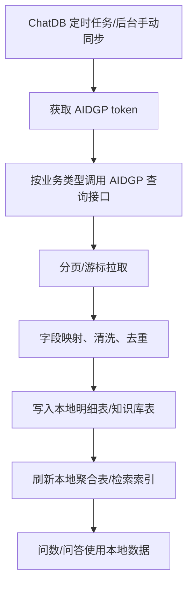
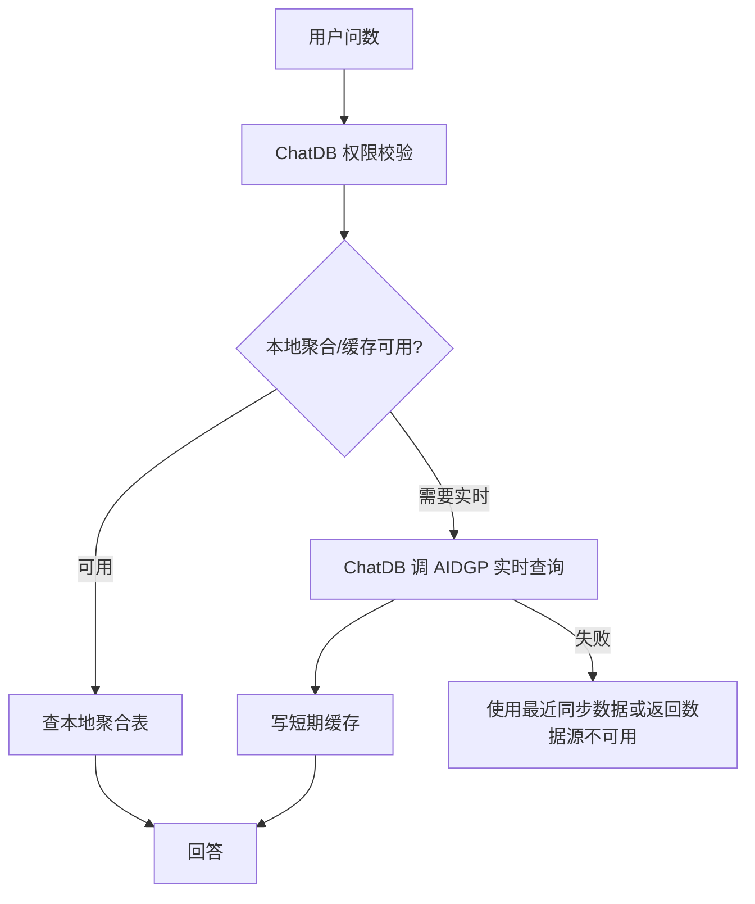

# AIDGP 对接 ChatDB 说明

适用方向：AIDGP 作为被调用方配合 ChatDB 主动拉取数据  
结论：AIDGP 数据不主动推送到 ChatDB，车流、人流、网格和知识库数据均由 ChatDB 按接口主动获取。

## 1. 对接边界

AIDGP 不需要主动调用 ChatDB 推送业务数据。AIDGP 需要提供稳定的查询、分页、增量同步和鉴权能力。

ChatDB 主动调用 AIDGP 获取：

- 车流数据。
- 人流数据。
- 网格数据。
- 知识库列表。
- 文档列表。
- 文档正文分段。
- 附件解析结果。
- 文档版本状态。
- 可选：AIDGP 侧文档权限辅助数据。

## 2. AIDGP 需要提供的能力

### 2.1 鉴权接口

```http
POST /openapi/oauth/token
Content-Type: application/json
```

请求：

```json
{
  "appKey": "CHATDB_APP_KEY",
  "appSecret": "CHATDB_APP_SECRET",
  "grantType": "client_credentials"
}
```

响应：

```json
{
  "code": 0,
  "message": "success",
  "data": {
    "accessToken": "token string",
    "tokenType": "Bearer",
    "expiresIn": 7200
  }
}
```

### 2.2 业务查询接口

AIDGP 需提供以下接口，供 ChatDB 主动调用：

```http
POST /openapi/chatdb/traffic/query
POST /openapi/chatdb/population/query
POST /openapi/chatdb/grid/query
POST /openapi/chatdb/knowledge-bases
POST /openapi/chatdb/documents
POST /openapi/chatdb/document-segments
POST /openapi/chatdb/document-view
POST /openapi/chatdb/knowledge-permissions
```

## 3. ChatDB 主动拉取流程



实时问数仅在必要时由 ChatDB 主动查询 AIDGP：



## 4. 请求头与签名

ChatDB 调用 AIDGP 时建议统一使用：

```http
Authorization: Bearer {accessToken}
X-App-Key: {appKey}
X-Request-Id: {uuid}
X-Timestamp: {unix_ms}
X-Nonce: {random}
X-Signature: {signature}
Content-Type: application/json; charset=utf-8
```

签名建议：

```text
bodySha256 = HEX(SHA256(rawBody))
canonical = method + "\n" + pathWithQuery + "\n" + timestamp + "\n" + nonce + "\n" + bodySha256
signature = BASE64(HMAC-SHA256(appSecret, canonical))
```

AIDGP 验签要求：

- `X-Timestamp` 与服务端时间偏差不超过 5 分钟。
- `X-Nonce` 在 5-10 分钟内不能重复。
- 使用原始 body 字节计算摘要。
- token、appSecret、签名原文不得写入业务日志。

如双方要求国密，可替换为：

- SM3 摘要。
- SM2 签名验签。
- SM4-GCM 字段级加密。

## 5. 分页与增量同步要求

AIDGP 所有列表接口建议支持：

```json
{
  "requestId": "uuid",
  "updatedAfter": "2026-05-18 00:00:00",
  "page": 1,
  "pageSize": 500,
  "cursor": ""
}
```

响应：

```json
{
  "code": 0,
  "message": "success",
  "requestId": "uuid",
  "data": {
    "list": [],
    "page": 1,
    "pageSize": 500,
    "total": 1000,
    "hasMore": true,
    "nextCursor": "cursor-value"
  }
}
```

要求：

- 支持 `updatedAfter` 增量同步。
- 支持 `syncVersion` 或 `updateTime` 判断幂等。
- 支持分页或 cursor。
- 同一请求参数重复调用应返回一致结果或等价结果。
- 删除、废止、禁用数据必须能通过状态字段同步给 ChatDB。
