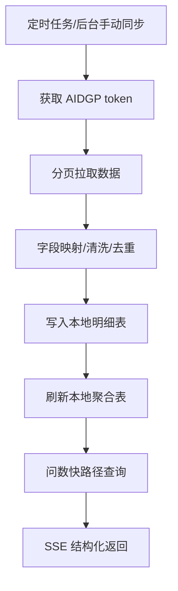
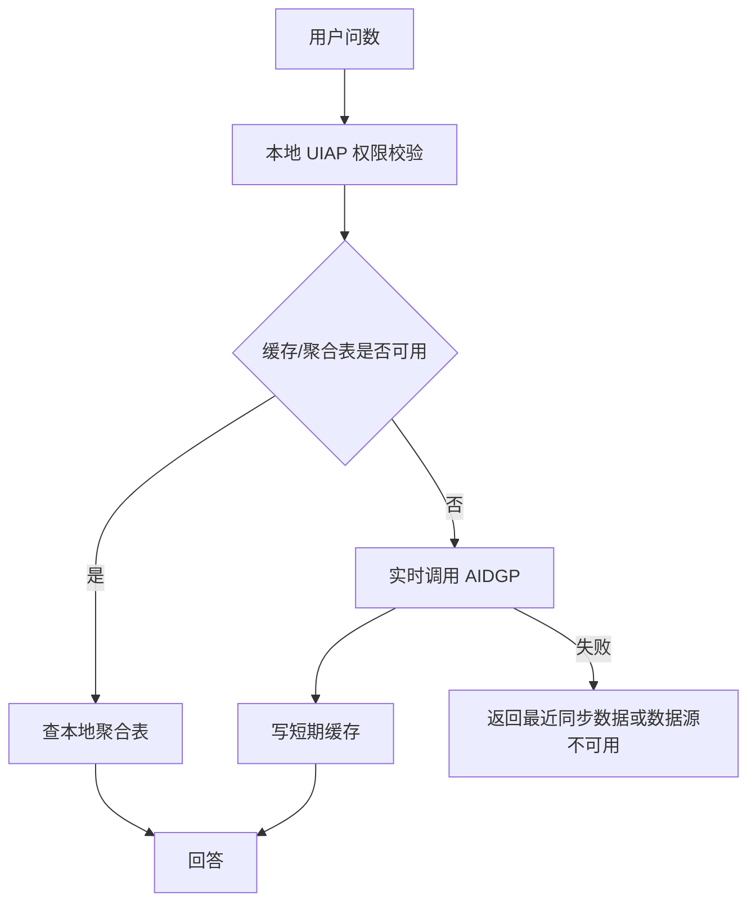

# ChatDB 对接 AIDGP 开发方案

适用方向：ChatDB 主动调用 AIDGP  
目标：AIDGP 数据由 ChatDB 主动获取。ChatDB 从 AIDGP 拉取问数业务数据和问答知识库数据，并同步到本地表、聚合表和检索表。

## 1. 对接范围

AIDGP 作为被调用方提供：

- 车流数据：明细、卡口设备、进出方向、港澳车、来源地、驻留时长。
- 人流数据：进出人数、区域/网格维度、小时/日趋势、流动人口。
- 网格数据：案件明细、结案率、区域排名、类别分布、重大案件。
- 问答知识库：知识库列表、文档列表、正文分段、附件解析、版本状态、引用定位、文档关联。

ChatDB 作为调用方负责：

- 定时或手动主动拉取 AIDGP 数据。
- 写入本地明细表、聚合表和知识库表。
- 高频问数优先查询本地聚合表。
- AIDGP 不主动推送数据；AIDGP 不可用时 ChatDB 降级到最近一次同步数据。

## 2. 推荐数据流程



强实时问题才走实时查询：



## 3. AIDGP 鉴权

```http
POST /openapi/oauth/token
Content-Type: application/json

{
  "appKey": "CHATDB_APP_KEY",
  "appSecret": "CHATDB_APP_SECRET",
  "grantType": "client_credentials"
}
```

响应：

```json
{
  "code": 0,
  "message": "success",
  "data": {
    "accessToken": "token string",
    "tokenType": "Bearer",
    "expiresIn": 7200
  }
}
```

业务请求头：

```http
Authorization: Bearer {accessToken}
X-App-Key: {appKey}
X-Request-Id: {uuid}
X-Timestamp: {unix_ms}
X-Nonce: {random}
X-Signature: {signature}
Content-Type: application/json; charset=utf-8
```

签名：

```text
bodySha256 = HEX(SHA256(rawBody))
canonical = method + "\n" + pathWithQuery + "\n" + timestamp + "\n" + nonce + "\n" + bodySha256
signature = BASE64(HMAC-SHA256(appSecret, canonical))
```

## 4. 车流接口

```http
POST /openapi/chatdb/traffic/query
Authorization: Bearer {token}
```

请求：

```json
{
  "requestId": "uuid",
  "dateFrom": "2026-05-18 00:00:00",
  "dateTo": "2026-05-18 23:59:59",
  "region": "高新区",
  "gateId": "",
  "gateName": "",
  "plate": "",
  "metrics": ["total", "inCount", "outCount", "hkMacauCount", "originCity"],
  "groupBy": "hour",
  "page": 1,
  "pageSize": 500
}
```

本地表：

- `traffic_gate_record`：明细表，现有。
- `traffic_gate_device`：卡口设备表，现有。
- `traffic_metric_hourly`：新增，小时聚合。
- `traffic_metric_daily`：新增，日聚合。
- `traffic_vehicle_stay_daily`：新增，车辆驻留聚合。

## 5. 人流接口

```http
POST /openapi/chatdb/population/query
Authorization: Bearer {token}
```

请求：

```json
{
  "requestId": "uuid",
  "dateFrom": "2026-05-18 00:00:00",
  "dateTo": "2026-05-18 23:59:59",
  "region": "高新区",
  "gridName": "",
  "metrics": ["inCount", "outCount", "netInCount", "floatingPopulationCount"],
  "groupBy": "hour",
  "page": 1,
  "pageSize": 500
}
```

本地表：

- `population_flow_record`：新增，人流明细。
- `population_metric_hourly`：新增，小时聚合。
- `population_metric_daily`：新增，日聚合。
- `population_floating_daily`：新增，流动人口聚合。

## 6. 网格接口

```http
POST /openapi/chatdb/grid/query
Authorization: Bearer {token}
```

请求：

```json
{
  "requestId": "uuid",
  "dateFrom": "2026-05-01",
  "dateTo": "2026-05-31",
  "region": "高新区",
  "community": "",
  "gridName": "",
  "caseType1": "",
  "caseType2": "",
  "metrics": ["caseCount", "closedCount", "closeRate", "majorCase"],
  "groupBy": "community",
  "page": 1,
  "pageSize": 500
}
```

本地表：

- `case_list`：现有案件明细表，可扩展。
- `grid_case_record`：可选新增，更完整承接 AIDGP 字段。
- `grid_metric_daily`：新增，日聚合。
- `grid_metric_monthly`：新增，月聚合。

## 7. 知识库接口

AIDGP 需提供：

```http
POST /openapi/chatdb/knowledge-bases
POST /openapi/chatdb/documents
POST /openapi/chatdb/document-segments
POST /openapi/chatdb/document-view
POST /openapi/chatdb/knowledge-permissions
POST /openapi/chatdb/document-relations
```

知识库字段：

```json
{
  "knowledgeCode": "policy",
  "knowledgeName": "政策制度库",
  "description": "政策、制度、规范文件",
  "enabled": true,
  "sort": 10,
  "externalId": "kb-001",
  "syncVersion": "202605180001",
  "updateTime": "2026-05-18 10:00:00"
}
```

文档字段：

```json
{
  "documentId": "doc-001",
  "knowledgeCode": "policy",
  "title": "某管理办法",
  "fileName": "某管理办法.pdf",
  "fileType": "pdf",
  "documentType": "policy",
  "status": "active",
  "version": "某管理办法",
  "effectiveDate": "2026-01-01",
  "supersededBy": "",
  "syncVersion": "202605180001",
  "updateTime": "2026-05-18 10:00:00"
}
```

字段映射：

| AIDGP 字段 | ChatDB 本地字段 | 说明 |
|---|---|---|
| `documentType` | `doc_type` | 文档类型枚举：policy/manual/form/rule/case，需 AIDGP 按此映射推送 |
| `version` | `title_group` | 同名文件不同版本共享同一值，用于版本分组 |
| `supersededBy` | `repealed_by` | 废止该文档的新版本标题或 ID |
| `effectiveDate` | `effective_date` | 生效日期，格式 YYYY-MM-DD |
| (无) | `repeal_date` | ChatDB 根据 `supersededBy` 关联查询自动填充 |

分段字段：

```json
{
  "segmentId": "seg-001",
  "documentId": "doc-001",
  "segmentIndex": 1,
  "content": "可检索正文或附件解析文本",
  "page": 1,
  "anchor": "p1-s1",
  "attachmentId": "",
  "attachmentName": "",
  "updateTime": "2026-05-18 10:00:00"
}
```

附件字段说明：
- `attachmentId`：该段落来源附件的外部 ID，为空表示段落来自文档正文
- `attachmentName`：附件文件名，供前端展示附件来源

ChatDB 侧将在 `qa_document_segment` 表新增 `attachment_id` 和 `attachment_name` 两列存储。若 AIDGP 已将附件解析内容放入 `content`，这两个字段可为空。

文档关联接口：

```http
POST /openapi/chatdb/document-relations
Authorization: Bearer {token}
```

请求：

```json
{
  "requestId": "uuid",
  "documentId": "",
  "pageSize": 500,
  "updatedAfter": "2026-05-18T00:00:00Z"
}
```

响应：

```json
{
  "code": 0,
  "data": {
    "list": [
      {
        "fromDocumentId": "doc-001",
        "toDocumentId": "doc-002",
        "relType": "reference",
        "description": "某管理办法引用了某实施细则",
        "enabled": true,
        "updateTime": "2026-05-18 10:00:00"
      }
    ],
    "pageSize": 500,
    "total": 100,
    "hasMore": true,
    "nextCursor": "cursor-value"
  }
}
```

关联类型 `relType` 枚举：`reference`（引用）/ `supplement`（补充）/ `repeal`（废止）/ `related`（相关）。

## 8. 性能策略

- 车流增量同步：每 1-5 分钟。
- 人流同步：按 AIDGP 数据产出节奏，建议小时级或日级。
- 网格同步：5-30 分钟或按批次。
- 知识库同步：10-60 分钟或变更推送触发。
- 文档+分段同步：30-60 分钟，增量 `updatedAfter`。
- 文档关联同步：30-60 分钟，增量 `updatedAfter`。
- 高频问数必须优先查询本地聚合表。
- 实时查询 AIDGP 超时建议 3-8 秒。

## 9. 定时同步任务清单

| 数据类型 | 默认频率 | 增量参数 | 说明 |
|---|---|---|---|
| 车流明细 | 30 分钟 | `updatedAfter` = 最近同步时间 | 高频，增量 |
| 人流明细 | 30 分钟 | `updatedAfter` = 最近同步时间 | 高频，增量 |
| 网格明细 | 30 分钟 | `updatedAfter` = 最近同步时间 | 高频，增量 |
| 知识库列表 | 60 分钟 | `updatedAfter` = 最近同步时间 | 低频，增量 |
| 文档列表+分段 | 60 分钟 | `updatedAfter` = 最近同步时间 | 低频，增量 |
| 文档关联 | 60 分钟 | `updatedAfter` = 最近同步时间 | 低频，增量 |
| 权限变更 | 手动触发 | `updatedAfter` = 最近同步时间 | 等对接 UIAP 后改为定时 |

所有定时任务均传入最近一次成功同步时间作为 `updatedAfter` 参数，实现增量同步。首次同步时 `updatedAfter` 为空，拉取全量数据。

## 10. 字段映射汇总

| AIDGP 字段 | ChatDB 本地字段 | 本地表 | 说明 |
|---|---|---|---|
| `documentType` | `doc_type` | `qa_knowledge_base` | 5 类枚举：policy/manual/form/rule/case |
| `version` | `title_group` | `qa_document` | 同名文件不同版本共享同一值 |
| `supersededBy` | `repealed_by` | `qa_document` | 废止该文档的新版本标题或 ID |
| `effectiveDate` | `effective_date` | `qa_document` | 生效日期，格式 YYYY-MM-DD |
| (无) | `repeal_date` | `qa_document` | ChatDB 根据 `supersededBy` 关联查询自动填充 |
| `attachmentId` | `attachment_id` | `qa_document_segment` | 段落来源附件 ID，为空表示正文 |
| `attachmentName` | `attachment_name` | `qa_document_segment` | 附件文件名，供前端展示 |
| `relType` | `rel_type` | `qa_document_relation` | 4 类枚举：reference/supplement/repeal/related |

## 11. 同步日志查询

ChatDB 管理端提供同步历史查询端点，方便运维排查：

```http
GET /admin/aidgp/sync-logs?syncType=documents&page=1&pageSize=20
Authorization: Bearer {adminToken}
```

响应：

```json
{
  "code": 0,
  "data": {
    "list": [
      {
        "id": 1,
        "syncType": "documents",
        "status": "success",
        "successCount": 50,
        "failureCount": 1,
        "skippedCount": 3,
        "startTime": 1716000000,
        "endTime": 1716000060,
        "message": ""
      }
    ],
    "total": 100,
    "page": 1,
    "pageSize": 20
  }
}
```

## 12. 开发任务

1. 实现 `provider=aidgp` 的真实 HTTP client。
2. 实现 token 缓存、刷新、401 重试。
3. 实现统一 `doJSON`、签名、分页、错误码映射。
4. 新增车流、人流、网格聚合表。
5. 实现三类业务数据同步任务。
6. 实现知识库、文档、分段同步任务（含 `doc_type`/`title_group`/`repealed_by` 字段映射）。
7. 实现文档关联同步任务（写入 `qa_document_relation`）。
8. `qa_document_segment` 表新增 `attachment_id`/`attachment_name` 两列。
9. 定时同步任务增加知识库+文档+关联同步，传入 `updatedAfter` 增量参数。
10. 快路径查询改为优先查本地聚合表。
11. 后台增加 AIDGP 连通性测试和同步日志。
12. 新增同步日志查询端点 `GET /admin/aidgp/sync-logs`。

## 13. 验收

## 13. 验收

- AIDGP token 获取和刷新成功。
- 车流、人流、网格同步成功。
- 知识库、文档、分段同步成功（字段映射正确：doc_type/title_group/repealed_by）。
- 文档关联同步成功（reference/supplement/repeal/related）。
- 分段附件字段 attachment_id/attachment_name 正确存储。
- 定时同步包含知识库+文档+关联，增量 updatedAfter 参数生效。
- 同步日志查询端点可用。
- 高频问数走本地聚合表。
- AIDGP 不可用时返回最近同步数据或明确错误。
- 日志不输出 token、appSecret、完整车牌、个人敏感信息。
