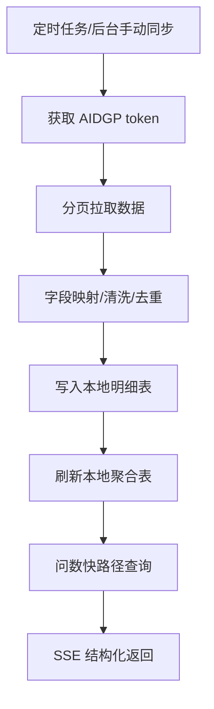
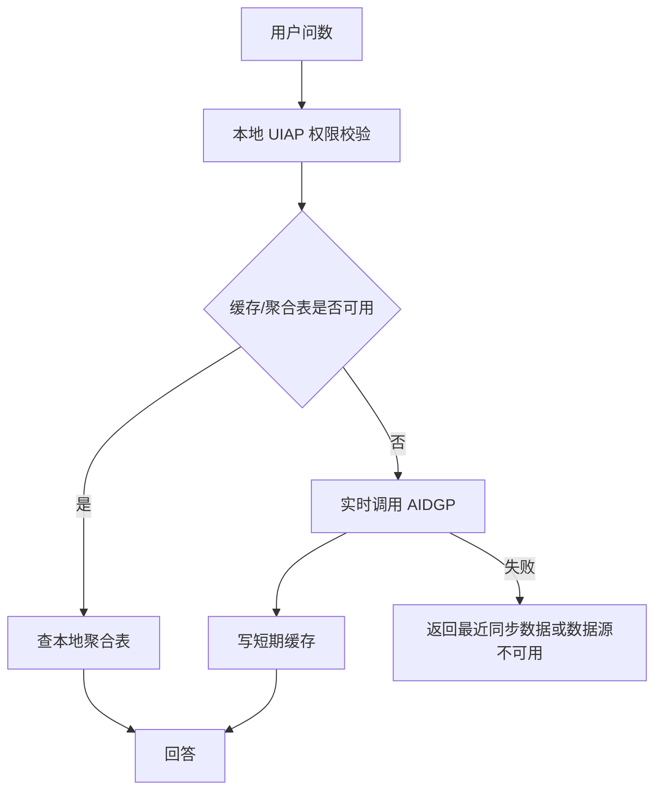

# ChatDB 对接 AIDGP 开发方案

适用方向：ChatDB 主动调用 AIDGP  
目标：AIDGP 数据由 ChatDB 主动获取。ChatDB 从 AIDGP 拉取问数业务数据和问答知识库数据，并同步到本地表、聚合表和检索表。

## 1. 对接范围

AIDGP 作为被调用方提供：

- 车流数据：明细、卡口设备、进出方向、港澳车、来源地、驻留时长。
- 人流数据：进出人数、区域/网格维度、小时/日趋势、流动人口。
- 网格数据：案件明细、结案率、区域排名、类别分布、重大案件。
- 问答知识库：知识库列表、文档列表、正文分段、附件解析、版本状态、引用定位。

ChatDB 作为调用方负责：

- 定时或手动主动拉取 AIDGP 数据。
- 写入本地明细表、聚合表和知识库表。
- 高频问数优先查询本地聚合表。
- AIDGP 不主动推送数据；AIDGP 不可用时 ChatDB 降级到最近一次同步数据。

## 2. 推荐数据流程



强实时问题才走实时查询：



## 3. AIDGP 鉴权

```http
POST /openapi/oauth/token
Content-Type: application/json

{
  "appKey": "CHATDB_APP_KEY",
  "appSecret": "CHATDB_APP_SECRET",
  "grantType": "client_credentials"
}
```

响应：

```json
{
  "code": 0,
  "message": "success",
  "data": {
    "accessToken": "token string",
    "tokenType": "Bearer",
    "expiresIn": 7200
  }
}
```

业务请求头：

```http
Authorization: Bearer {accessToken}
X-App-Key: {appKey}
X-Request-Id: {uuid}
X-Timestamp: {unix_ms}
X-Nonce: {random}
X-Signature: {signature}
Content-Type: application/json; charset=utf-8
```

签名：

```text
bodySha256 = HEX(SHA256(rawBody))
canonical = method + "\n" + pathWithQuery + "\n" + timestamp + "\n" + nonce + "\n" + bodySha256
signature = BASE64(HMAC-SHA256(appSecret, canonical))
```

## 4. 车流接口

```http
POST /openapi/chatdb/traffic/query
Authorization: Bearer {token}
```

请求：

```json
{
  "requestId": "uuid",
  "dateFrom": "2026-05-18 00:00:00",
  "dateTo": "2026-05-18 23:59:59",
  "region": "高新区",
  "gateId": "",
  "gateName": "",
  "plate": "",
  "metrics": ["total", "inCount", "outCount", "hkMacauCount", "originCity"],
  "groupBy": "hour",
  "page": 1,
  "pageSize": 500
}
```

本地表：

- `traffic_gate_record`：明细表，现有。
- `traffic_gate_device`：卡口设备表，现有。
- `traffic_metric_hourly`：新增，小时聚合。
- `traffic_metric_daily`：新增，日聚合。
- `traffic_vehicle_stay_daily`：新增，车辆驻留聚合。

## 5. 人流接口

```http
POST /openapi/chatdb/population/query
Authorization: Bearer {token}
```

请求：

```json
{
  "requestId": "uuid",
  "dateFrom": "2026-05-18 00:00:00",
  "dateTo": "2026-05-18 23:59:59",
  "region": "高新区",
  "gridName": "",
  "metrics": ["inCount", "outCount", "netInCount", "floatingPopulationCount"],
  "groupBy": "hour",
  "page": 1,
  "pageSize": 500
}
```

本地表：

- `population_flow_record`：新增，人流明细。
- `population_metric_hourly`：新增，小时聚合。
- `population_metric_daily`：新增，日聚合。
- `population_floating_daily`：新增，流动人口聚合。

## 6. 网格接口

```http
POST /openapi/chatdb/grid/query
Authorization: Bearer {token}
```

请求：

```json
{
  "requestId": "uuid",
  "dateFrom": "2026-05-01",
  "dateTo": "2026-05-31",
  "region": "高新区",
  "community": "",
  "gridName": "",
  "caseType1": "",
  "caseType2": "",
  "metrics": ["caseCount", "closedCount", "closeRate", "majorCase"],
  "groupBy": "community",
  "page": 1,
  "pageSize": 500
}
```

本地表：

- `case_list`：现有案件明细表，可扩展。
- `grid_case_record`：可选新增，更完整承接 AIDGP 字段。
- `grid_metric_daily`：新增，日聚合。
- `grid_metric_monthly`：新增，月聚合。

## 7. 知识库接口

AIDGP 需提供：

```http
POST /openapi/chatdb/knowledge-bases
POST /openapi/chatdb/documents
POST /openapi/chatdb/document-segments
POST /openapi/chatdb/document-view
POST /openapi/chatdb/knowledge-permissions
```

知识库字段：

```json
{
  "knowledgeCode": "policy",
  "knowledgeName": "政策制度库",
  "description": "政策、制度、规范文件",
  "enabled": true,
  "sort": 10,
  "externalId": "kb-001",
  "syncVersion": "202605180001",
  "updateTime": "2026-05-18 10:00:00"
}
```

文档字段：

```json
{
  "documentId": "doc-001",
  "knowledgeCode": "policy",
  "title": "某管理办法",
  "fileName": "某管理办法.pdf",
  "fileType": "pdf",
  "documentType": "阅件",
  "status": "active",
  "version": "v3",
  "effectiveDate": "2026-01-01",
  "supersededBy": "",
  "syncVersion": "202605180001",
  "updateTime": "2026-05-18 10:00:00"
}
```

分段字段：

```json
{
  "segmentId": "seg-001",
  "documentId": "doc-001",
  "segmentIndex": 1,
  "content": "可检索正文或附件解析文本",
  "page": 1,
  "anchor": "p1-s1",
  "attachmentId": "",
  "attachmentName": "",
  "updateTime": "2026-05-18 10:00:00"
}
```

## 8. 性能策略

- 车流增量同步：每 1-5 分钟。
- 人流同步：按 AIDGP 数据产出节奏，建议小时级或日级。
- 网格同步：5-30 分钟或按批次。
- 知识库同步：10-60 分钟或变更推送触发。
- 高频问数必须优先查询本地聚合表。
- 实时查询 AIDGP 超时建议 3-8 秒。

## 9. 开发任务

1. 实现 `provider=aidgp` 的真实 HTTP client。
2. 实现 token 缓存、刷新、401 重试。
3. 实现统一 `doJSON`、签名、分页、错误码映射。
4. 新增车流、人流、网格聚合表。
5. 实现三类业务数据同步任务。
6. 实现知识库、文档、分段同步任务。
7. 快路径查询改为优先查本地聚合表。
8. 后台增加 AIDGP 连通性测试和同步日志。

## 10. 验收

- AIDGP token 获取和刷新成功。
- 车流、人流、网格同步成功。
- 知识库、文档、分段同步成功。
- 高频问数走本地聚合表。
- AIDGP 不可用时返回最近同步数据或明确错误。
- 日志不输出 token、appSecret、完整车牌、个人敏感信息。
