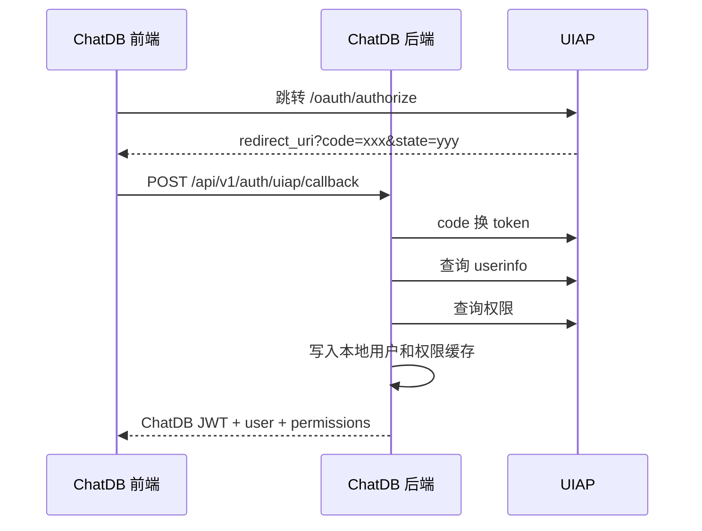

# ChatDB 对接 UIAP 开发方案

适用方向：ChatDB 主动调用 UIAP  
目标：登录、单点登录、用户信息、组织角色、问数主题权限、问答知识库权限统一由 UIAP 提供。UIAP 不主动推送数据，ChatDB 在登录时查询，并通过定时轮询兜底刷新。

## 1. 对接范围

ChatDB 主动从 UIAP 获取：

- 用户登录态。
- 用户基础信息：`userId`、`username`、`displayName`、组织、角色。
- 问数主题权限：`grid`、`population`、`traffic`。
- 问答知识库权限：`knowledgeCode`、可选 `documentId`。
- 权限版本号和权限摘要，用于缓存失效和前端刷新。

## 2. 登录流程

推荐 OAuth2/OIDC 授权码模式。



## 3. ChatDB 新增接口

```http
POST /api/v1/auth/uiap/callback
Content-Type: application/json
```

请求：

```json
{
  "code": "uiap_authorization_code",
  "state": "opaque_state",
  "redirectUri": "https://chatdb.example.com/auth/callback"
}
```

响应：

```json
{
  "code": 0,
  "message": "success",
  "data": {
    "accessToken": "chatdb-jwt",
    "expiresIn": 7200,
    "user": {
      "userId": "u001",
      "username": "zhangsan",
      "displayName": "张三",
      "orgCode": "org001",
      "roles": ["grid_user"]
    },
    "permissions": {
      "topics": ["grid", "traffic"],
      "knowledgeCodes": ["policy", "manual"],
      "permissionVersion": 12
    }
  }
}
```

## 4. UIAP 需提供接口

### 4.1 token 接口

```http
POST /oauth/token
Content-Type: application/json
```

请求：

```json
{
  "grant_type": "authorization_code",
  "code": "authorization_code",
  "redirect_uri": "https://chatdb.example.com/auth/callback",
  "client_id": "chatdb",
  "client_secret": "***"
}
```

### 4.2 用户信息接口

```http
GET /oauth/userinfo
Authorization: Bearer {uiap_access_token}
```

响应：

```json
{
  "sub": "u001",
  "username": "zhangsan",
  "displayName": "张三",
  "orgCode": "org001",
  "orgName": "某组织",
  "roles": ["grid_user", "qa_user"],
  "enabled": true
}
```

### 4.3 权限查询接口

```http
POST /openapi/chatdb/permissions/query
Authorization: Bearer {uiap_access_token}
```

请求：

```json
{
  "requestId": "uuid",
  "userId": "u001",
  "username": "zhangsan",
  "includeTopicPermissions": true,
  "includeKnowledgePermissions": true
}
```

### 4.4 批量权限查询接口

用于 ChatDB 定时轮询兜底刷新权限。

```http
POST /openapi/chatdb/permissions/batch-query
Authorization: Bearer {service_access_token}
```

请求：

```json
{
  "requestId": "uuid",
  "updatedAfter": "2026-05-18 00:00:00",
  "page": 1,
  "pageSize": 500
}
```

响应：

```json
{
  "code": 0,
  "message": "success",
  "requestId": "uuid",
  "data": {
    "list": [],
    "page": 1,
    "pageSize": 500,
    "total": 0,
    "hasMore": false
  }
}
```

## 4.5 权限刷新策略

- 登录时实时查询当前用户权限。
- 前端 bootstrap 时读取 ChatDB 本地权限缓存。
- ChatDB 定时轮询 UIAP 批量权限接口，刷新变更用户。
- UIAP 不需要主动推送权限变更。
- 权限查询失败时不能扩大权限；可使用未过期缓存，缓存过期则按无权限处理。

响应：

```json
{
  "code": 0,
  "message": "success",
  "requestId": "uuid",
  "data": {
    "userId": "u001",
    "enabled": true,
    "topicPermissions": [
      {"topic": "grid", "enabled": true},
      {"topic": "population", "enabled": false},
      {"topic": "traffic", "enabled": true}
    ],
    "knowledgePermissions": [
      {"knowledgeCode": "policy", "enabled": true},
      {"knowledgeCode": "manual", "enabled": true}
    ],
    "documentPermissions": [
      {"documentId": "doc-001", "enabled": true}
    ],
    "permissionVersion": 12,
    "permissionHash": "sha256-hex",
    "updateTime": "2026-05-18 10:00:00"
  }
}
```

## 5. 加密与鉴权

### 5.1 传输层

- 生产环境必须使用 HTTPS TLS 1.2+。
- 高安全场景可启用 mTLS。

### 5.2 UIAP token

- 推荐 OIDC access token。
- ChatDB 使用 UIAP token 调用 `userinfo` 和权限接口。
- ChatDB 本地会话使用 ChatDB 自己签发的 JWT。

### 5.3 请求签名

如 UIAP 要求业务接口签名，推荐：

```text
bodySha256 = HEX(SHA256(rawBody))
canonical = method + "\n" + pathWithQuery + "\n" + timestamp + "\n" + nonce + "\n" + bodySha256
signature = BASE64(HMAC-SHA256(clientSecret, canonical))
```

请求头：

```http
X-Client-Id: chatdb
X-Request-Id: {uuid}
X-Timestamp: {unix_ms}
X-Nonce: {random}
X-Signature: {signature}
```

## 6. 本地落库

```sql
CREATE TABLE IF NOT EXISTS uiap_user_profile (
  id BIGINT PRIMARY KEY AUTO_INCREMENT,
  uiap_user_id VARCHAR(128) NOT NULL,
  username VARCHAR(128) NOT NULL,
  display_name VARCHAR(128),
  org_code VARCHAR(128),
  org_name VARCHAR(128),
  roles_json JSON,
  enabled TINYINT NOT NULL DEFAULT 1,
  permission_version INT NOT NULL DEFAULT 1,
  permission_hash VARCHAR(128),
  last_sync_time INT NOT NULL DEFAULT 0,
  create_time INT NOT NULL,
  update_time INT NOT NULL,
  UNIQUE KEY uk_uiap_user_id (uiap_user_id),
  UNIQUE KEY uk_username (username)
) ENGINE=InnoDB DEFAULT CHARSET=utf8mb4;
```

```sql
CREATE TABLE IF NOT EXISTS uiap_topic_permission (
  id BIGINT PRIMARY KEY AUTO_INCREMENT,
  uiap_user_id VARCHAR(128) NOT NULL,
  topic VARCHAR(32) NOT NULL,
  enabled TINYINT NOT NULL DEFAULT 1,
  permission_version INT NOT NULL DEFAULT 1,
  update_time INT NOT NULL,
  UNIQUE KEY uk_uiap_topic (uiap_user_id, topic)
) ENGINE=InnoDB DEFAULT CHARSET=utf8mb4;
```

```sql
CREATE TABLE IF NOT EXISTS uiap_knowledge_permission (
  id BIGINT PRIMARY KEY AUTO_INCREMENT,
  uiap_user_id VARCHAR(128) NOT NULL,
  knowledge_code VARCHAR(128) NOT NULL,
  document_id VARCHAR(128) NOT NULL DEFAULT '',
  enabled TINYINT NOT NULL DEFAULT 1,
  permission_version INT NOT NULL DEFAULT 1,
  update_time INT NOT NULL,
  UNIQUE KEY uk_uiap_knowledge_doc (uiap_user_id, knowledge_code, document_id)
) ENGINE=InnoDB DEFAULT CHARSET=utf8mb4;
```

## 7. 开发任务

1. 新增 UIAP 配置项和环境变量。
2. 实现 UIAP client：token、userinfo、permissions。
3. 新增 `/api/v1/auth/uiap/callback`。
4. 本地落库用户、主题权限、知识库权限。
5. 实现批量权限轮询任务。
6. 替换生产登录流程。
7. 问数、问答接口统一读取 UIAP 权限缓存。
8. 前端登录态和入口权限刷新联调。

## 8. 验收

- UIAP 用户可登录 ChatDB。
- 无车流权限用户看不到车流入口，接口也拒绝访问。
- 无知识库权限用户不能检索和打开引用。
- UIAP 权限变更后，ChatDB 本地权限能刷新。
- 日志不输出 UIAP token、clientSecret 和用户敏感信息。
