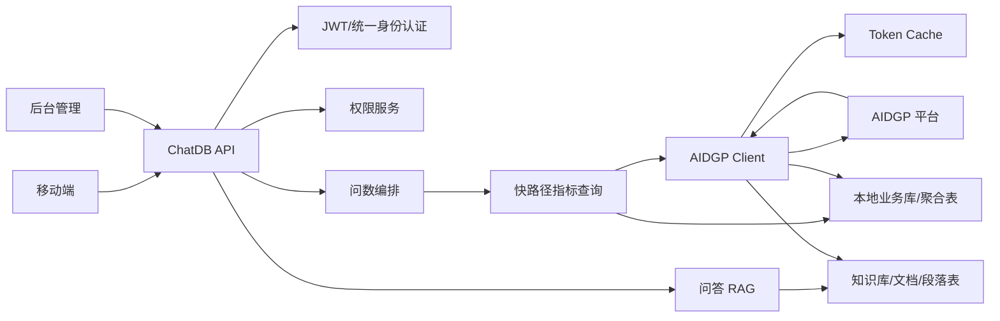

# 问答问数未完成功能上线开发方案

目标：以“可以上线”为标准补齐功能清单中未完成和部分完成项，重点解决 AIDGP 真实对接、网格/人流/车流真实问数、问答知识库生产化、后台管理安全和移动端体验闭环。

## 1. 上线范围与优先级

### P0 必须上线

- AIDGP token 获取、刷新、签名/鉴权、错误码、重试。
- 网格、人流、车流 AIDGP 查询和同步。
- 人流正式数据模型、每日同步、趋势/区域/流动人口查询。
- 车流预聚合、驻留时长、节假日/同比/来源地指标。
- 网格同步、月度覆盖、结案率/排名/趋势指标。
- 问数澄清选项结构化返回。
- 问答 AIDGP 知识库、文档、权限同步。
- 后台 admin 鉴权生产化。
- 中文乱码治理。
- 密钥治理。
- 端到端验收脚本。

### P1 可以紧随上线

- 洞察分析完整展开/收起结构化字段。
- 图表复制、图表类型切换。
- 管理/执行文件联动图谱。
- 文件版本智能识别增强。
- 联网搜索真实供应商。
- 用户问题自动沉淀和标准问法提炼。

## 2. 总体架构



原则：

- 高频问数用结构化快路径，不依赖大模型生成 SQL。
- 复杂问数用大模型 + 受控工具，但最终数据必须来自 AIDGP 或本地可信表。
- AIDGP 实时查询失败时只允许降级到有时效标记的本地缓存。
- 所有权限先本地校验，再调用 AIDGP；AIDGP 返回也要做二次权限过滤。

## 3. 迭代计划

### 阶段 1：上线安全基线（2 天）

开发内容：

- 将 `config/config.yaml` 中真实密钥迁移到环境变量。
- 支持 `CHATDB_*` 环境变量覆盖 AIDGP、AI、数据库、Redis、JWT 配置。
- 后台 `/admin/login` 改为真实 JWT，废弃 `admin-dev-token`。
- 源码和 Prompt 统一转 UTF-8，修复用户可见乱码。
- 增加敏感字段日志脱敏。

验收：

- 代码仓库不包含真实 key。
- 登录后台返回可校验 JWT。
- 中文错误信息、接口文案、问数回答无乱码。
- `go test ./...` 通过。

### 阶段 2：AIDGP 基础客户端（3 天）

开发内容：

- 新增 `internal/logic/aidgp/http_client.go`。
- 实现 token 获取、缓存、刷新、401 重试。
- 实现统一 `doJSON` 请求方法。
- 实现错误码映射。
- 实现超时、重试、requestId、日志。
- 保留 MockClient 作为测试 provider。

验收：

- token 成功获取并缓存。
- token 过期后自动刷新。
- 401 自动重试一次。
- AIDGP 5xx 按策略重试。
- 失败写入 `qa_sync_log`。

### 阶段 3：车流上线能力（5 天）

开发内容：

- 对接 AIDGP `/traffic/query`。
- 增加车流预聚合表：
  - `traffic_metric_hourly`
  - `traffic_metric_daily`
  - `traffic_vehicle_stay_daily`
- 增加同步任务：
  - 每 5 分钟补偿最近 30 分钟。
  - 每天凌晨对账前一日。
- 完善 `/traffic/aggregate`：
  - 优先查预聚合。
  - 支持 `holiday`。
  - 支持 `originCity`、`stayDuration`。
- 完善问数快路径：
  - 今日车流进出。
  - 卡口流入/流出 TopN。
  - 近 7 天趋势。
  - 港澳车占比。
  - 外地车来源地 Top。
  - 港澳车/外地车驻留时长。
  - 同比/环比。

验收：

- “今天高新区车流进出情况怎么样？”返回总流入、总流出、总车流量。
- “最近一周车流变化趋势”返回折线图。
- “今天哪个卡口流量最大”返回 Top1 和柱状图。
- “港澳车停留时长分布”返回三档分布。
- AIDGP 与本地聚合按日对账差异为 0。

### 阶段 4：人流上线能力（5 天）

开发内容：

- 新增人流表：
  - `population_flow_record`
  - `population_metric_daily`
  - `population_metric_hourly`
  - `population_floating_daily`
- 对接 AIDGP `/population/query`。
- 每日同步人流数据，支持最近 7 天补偿。
- 实现人流查询服务：
  - 进出趋势。
  - 净流入。
  - 区域/网格排名。
  - 节假日前后对比。
  - 上一年同期对比。
  - 流动人口规模和分布。
- 替换当前动态探测表名的临时逻辑。

验收：

- “过去一周人流进出趋势如何？”返回进/出双折线。
- “节假日人流对比”返回上一年同期 + 节假日前对比。
- “本地流动人口规模/分布”返回脱敏聚合数据。
- 无人流权限用户无法访问入口和数据。

### 阶段 5：网格上线能力（4 天）

开发内容：

- 对接 AIDGP `/grid/query`。
- 扩展 `case_list` 或新增 `grid_case_record`，补齐：
  - 一级/二级类别。
  - 街道、社区、网格。
  - 结案时间、状态。
  - 影响分、难度分、涉及人数。
- 增加 `grid_metric_monthly`。
- 完善月度导入：
  - 模板下载。
  - 按月份 + 案件编号幂等覆盖。
  - 导入前校验。
  - 导入失败明细。
  - 导入回滚。
- 完善网格问数快路径：
  - 案件总量。
  - 结案率。
  - 社区/网格排名。
  - 二级类别占比。
  - 趋势。
  - 时段分布。
  - 重大案件 Top1。

验收：

- 清单第二页网格典型问题全部可回答。
- 月度重复导入以最新数据覆盖。
- 导入错误可下载并定位行号。
- 重大案件回答包含案件名称、判断依据、Top1。

### 阶段 6：问答知识库生产化（5 天）

开发内容：

- 对接 AIDGP 知识库列表。
- 对接文档列表和分段。
- 对接附件解析结果。
- 对接权限。
- 支持文件版本状态：
  - active
  - abolished
  - revised
  - draft
- 检索只使用 active 文档。
- 引用详情返回 AIDGP 原文定位字段。
- 文档段落同步采用 `documentId + syncVersion` 幂等。

验收：

- 文档库列表与 AIDGP 一致。
- 无权限知识库不展示。
- 无权限文档不参与检索、不出现在引用、不允许打开。
- 附件内容可被问答引用。
- 废止文件不会被回答引用。

### 阶段 7：问数交互结构化（3 天）

开发内容：

- 增加统一 SSE 事件：
  - `clarification`
  - `answer_section`
  - `chart`
  - `insight`
  - `source`
- 模糊问题返回 2-5 个标准化选项：

```json
{
  "event": "clarification",
  "data": {
    "question": "你想按哪个维度统计车流最多？",
    "options": [
      {"label": "按卡口", "value": "gate"},
      {"label": "按行政区域", "value": "region"},
      {"label": "按网格", "value": "grid"}
    ],
    "hint": "都不准确重新输入即可"
  }
}
```

- 问数回答统一结构：
  - 精准结论。
  - 特征洞察。
  - 可视化。
  - 洞察分析。

验收：

- “哪个地方车流最多”触发澄清。
- 用户选择后继续同一会话。
- 单数值不返回图表。
- 趋势/对比返回图表。

### 阶段 8：后台和运维闭环（3 天）

开发内容：

- 数据接入管理联动真实 AIDGP 同步任务。
- 增加同步任务重试按钮。
- 增加最近错误、成功数、失败数、跳过数。
- 增加 AIDGP 连接测试。
- 增加数据对账报表。
- 增加 Prometheus 指标：
  - AIDGP 请求耗时。
  - token 刷新次数。
  - 同步成功/失败数。
  - 问数快路径命中率。
  - 降级次数。

验收：

- 后台能一键测试 AIDGP token 和业务接口。
- 同步失败能看到具体错误和 externalId。
- 能按主题查看数据新鲜度。

### 阶段 9：移动端联调验收（4 天）

后端配合前端完成：

- 入口权限隐藏。
- 告警展示、关闭、点击带问题进入问数。
- 文字 100 字限制。
- 发送/停止。
- 语音输入和静默停止。
- 澄清选项按钮。
- 洞察展开/收起。
- 图表类型切换。
- 图表复制为图片。
- 问答引用跳转。
- 问答参考资料折叠面板。

验收：

- 功能清单 P0 全部通过。
- P1 标记是否随版本上线。

## 4. 数据库变更建议

### 4.1 人流表

见 `docs/aidgp-project-integration-guide.md` 中 `population_flow_record`。

建议补充：

```sql
CREATE TABLE IF NOT EXISTS population_metric_daily (
  id BIGINT PRIMARY KEY AUTO_INCREMENT,
  metric_date DATE NOT NULL,
  region VARCHAR(128),
  grid_name VARCHAR(128),
  in_count INT NOT NULL DEFAULT 0,
  out_count INT NOT NULL DEFAULT 0,
  net_in_count INT NOT NULL DEFAULT 0,
  floating_population_count INT NOT NULL DEFAULT 0,
  source_provider VARCHAR(32) NOT NULL DEFAULT 'aidgp',
  update_time INT NOT NULL,
  UNIQUE KEY uk_pop_daily (metric_date, region, grid_name),
  INDEX idx_pop_region_date (region, metric_date)
) ENGINE=InnoDB DEFAULT CHARSET=utf8mb4;
```

### 4.2 车流聚合表

```sql
CREATE TABLE IF NOT EXISTS traffic_metric_daily (
  id BIGINT PRIMARY KEY AUTO_INCREMENT,
  metric_date DATE NOT NULL,
  region VARCHAR(128),
  device_id VARCHAR(64),
  device_name VARCHAR(128),
  total INT NOT NULL DEFAULT 0,
  in_count INT NOT NULL DEFAULT 0,
  out_count INT NOT NULL DEFAULT 0,
  hk_macau_count INT NOT NULL DEFAULT 0,
  mainland_count INT NOT NULL DEFAULT 0,
  foreign_count INT NOT NULL DEFAULT 0,
  update_time INT NOT NULL,
  UNIQUE KEY uk_traffic_daily (metric_date, region, device_id),
  INDEX idx_traffic_date_region (metric_date, region)
) ENGINE=InnoDB DEFAULT CHARSET=utf8mb4;
```

### 4.3 网格指标表

```sql
CREATE TABLE IF NOT EXISTS grid_metric_monthly (
  id BIGINT PRIMARY KEY AUTO_INCREMENT,
  metric_month VARCHAR(7) NOT NULL,
  region VARCHAR(128),
  community VARCHAR(128),
  grid_name VARCHAR(128),
  case_type1 VARCHAR(128),
  case_type2 VARCHAR(128),
  case_count INT NOT NULL DEFAULT 0,
  closed_count INT NOT NULL DEFAULT 0,
  close_rate DECIMAL(8,4) NOT NULL DEFAULT 0,
  avg_handle_hours DECIMAL(10,2) NOT NULL DEFAULT 0,
  update_time INT NOT NULL,
  UNIQUE KEY uk_grid_month (metric_month, region, community, grid_name, case_type1, case_type2)
) ENGINE=InnoDB DEFAULT CHARSET=utf8mb4;
```

## 5. 测试方案

### 5.1 自动化测试

必须补充：

- `internal/logic/aidgp`：token、签名、错误码、分页、幂等。
- `internal/logic/population`：统计口径。
- `internal/logic/traffic`：预聚合、驻留时长、节假日。
- `internal/controller/ai_chat`：澄清事件、快路径回答结构。
- `internal/controller/qa`：权限、引用、AIDGP 同步。

执行：

```bash
go test ./...
```

### 5.2 接口冒烟

- 登录。
- 查询 bootstrap。
- 查询主题。
- 触发 AIDGP token。
- 同步三类业务数据。
- 发送 10 条问数典型问题。
- 发送 5 条问答典型问题。
- 检查引用跳转。
- 检查无权限拦截。

### 5.3 验收数据集

至少准备：

- 网格：3 个月、3 个社区、10 个二级类别、1000 条案件。
- 人流：连续 30 天、进出维度、区域/网格维度、节假日、上一年同期。
- 车流：连续 30 天、至少 5 个卡口、港澳车、外地车、省内车、轨迹可计算驻留。
- 问答：2 个知识库、20 篇文档、附件解析、废止版本、权限差异。

## 6. 上线检查清单

- [ ] `go test ./...` 通过。
- [ ] AIDGP 测试环境 token 通过。
- [ ] AIDGP 生产环境 token 通过。
- [ ] 网格、人流、车流同步成功。
- [ ] 数据对账通过。
- [ ] 无权限用户无法访问未授权主题和文档。
- [ ] 移动端 P0 功能验收通过。
- [ ] 后台 admin JWT 生效。
- [ ] 中文无乱码。
- [ ] 日志无 token、密钥、个人敏感信息。
- [ ] 配置文件无真实密钥。
- [ ] 数据库索引已执行。
- [ ] 回滚方案已准备。

## 7. 回滚方案

- AIDGP provider 支持从 `aidgp` 切回 `local`。
- 保留本地表最近一次成功同步数据。
- 问数接口在 AIDGP 不可用时返回“数据源暂不可用/使用最近同步数据”的明确口径。
- 数据库变更只新增表和字段，不删除旧字段。
- 发布失败时回滚应用版本，不回滚数据。

## 8. 预计排期

| 阶段 | 工作 | 工期 |
|---|---|---:|
| 1 | 安全基线 | 2 天 |
| 2 | AIDGP 基础客户端 | 3 天 |
| 3 | 车流生产化 | 5 天 |
| 4 | 人流生产化 | 5 天 |
| 5 | 网格生产化 | 4 天 |
| 6 | 问答知识库生产化 | 5 天 |
| 7 | 问数交互结构化 | 3 天 |
| 8 | 后台和运维闭环 | 3 天 |
| 9 | 移动端联调验收 | 4 天 |

合计约 34 人日。若 AIDGP 接口契约和测试数据提前稳定，车流、人流、网格三条线可以并行，日历时间可压缩到 2-3 周。

