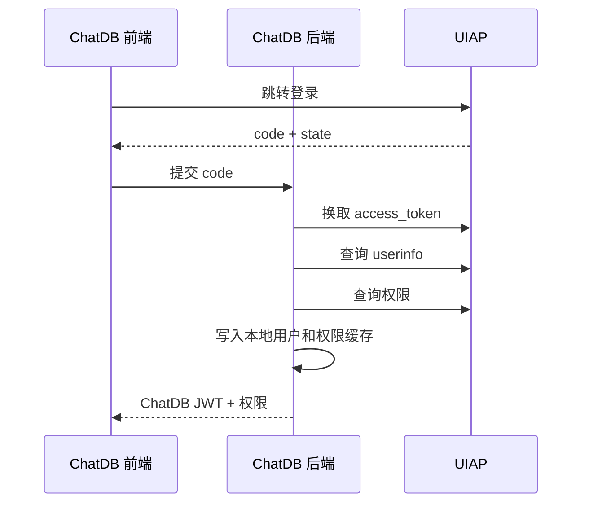
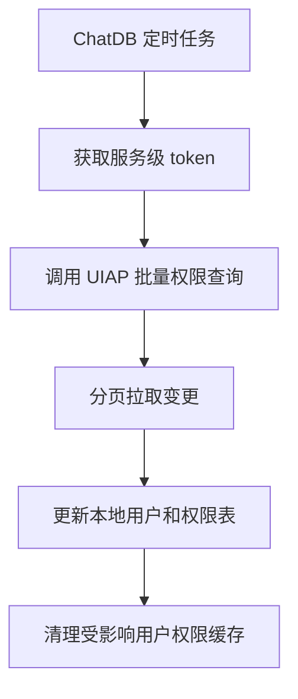

# UIAP 对接 ChatDB 说明

适用方向：UIAP 作为被调用方配合 ChatDB 主动获取身份和权限数据  
结论：UIAP 不需要主动推送用户、组织、角色或权限数据到 ChatDB。ChatDB 在用户登录时主动查询 UIAP，并通过定时轮询作为兜底刷新机制。

## 1. 对接边界

UIAP 不需要主动调用 ChatDB 推送权限变更。UIAP 需要提供稳定的登录鉴权、用户信息查询和权限查询能力。

ChatDB 主动调用 UIAP 获取：

- 用户登录 token。
- 用户基础信息。
- 用户组织信息。
- 用户角色信息。
- 问数主题权限：`grid`、`population`、`traffic`。
- 问答知识库权限：`knowledgeCode`。
- 可选：文档级权限：`documentId`。
- 权限版本号和权限摘要。

## 2. UIAP 需要提供的能力

### 2.1 授权码登录接口

```http
GET /oauth/authorize
```

请求参数：

| 参数 | 必填 | 说明 |
|---|---|---|
| `client_id` | 是 | UIAP 分配给 ChatDB 的客户端 ID |
| `redirect_uri` | 是 | ChatDB 回调地址 |
| `response_type` | 是 | 固定为 `code` |
| `scope` | 否 | 建议包含 `openid profile permissions` |
| `state` | 是 | ChatDB 生成的防 CSRF 随机值 |
| `code_challenge` | 可选 | 如支持 PKCE，建议启用 |
| `code_challenge_method` | 可选 | 推荐 `S256` |

登录成功后，UIAP 跳转：

```http
302 {redirect_uri}?code={authorization_code}&state={state}
```

### 2.2 token 接口

```http
POST /oauth/token
Content-Type: application/json
```

请求：

```json
{
  "grant_type": "authorization_code",
  "code": "authorization_code",
  "redirect_uri": "https://chatdb.example.com/auth/callback",
  "client_id": "chatdb",
  "client_secret": "***"
}
```

响应：

```json
{
  "access_token": "uiap-access-token",
  "token_type": "Bearer",
  "expires_in": 7200,
  "refresh_token": "optional-refresh-token",
  "id_token": "optional-oidc-id-token"
}
```

### 2.3 用户信息接口

```http
GET /oauth/userinfo
Authorization: Bearer {uiap_access_token}
```

响应：

```json
{
  "sub": "u001",
  "username": "zhangsan",
  "displayName": "张三",
  "orgCode": "org001",
  "orgName": "某组织",
  "roles": ["grid_user", "qa_user"],
  "enabled": true,
  "updateTime": "2026-05-18 10:00:00"
}
```

### 2.4 权限查询接口

```http
POST /openapi/chatdb/permissions/query
Authorization: Bearer {uiap_access_token}
```

请求：

```json
{
  "requestId": "uuid",
  "userId": "u001",
  "username": "zhangsan",
  "includeTopicPermissions": true,
  "includeKnowledgePermissions": true,
  "includeDocumentPermissions": false
}
```

响应：

```json
{
  "code": 0,
  "message": "success",
  "requestId": "uuid",
  "data": {
    "userId": "u001",
    "enabled": true,
    "topicPermissions": [
      {"topic": "grid", "enabled": true},
      {"topic": "population", "enabled": false},
      {"topic": "traffic", "enabled": true}
    ],
    "knowledgePermissions": [
      {"knowledgeCode": "policy", "enabled": true},
      {"knowledgeCode": "manual", "enabled": true}
    ],
    "documentPermissions": [
      {"documentId": "doc-001", "enabled": true}
    ],
    "permissionVersion": 12,
    "permissionHash": "sha256-hex",
    "updateTime": "2026-05-18 10:00:00"
  }
}
```

### 2.5 批量权限查询接口

定时轮询兜底建议提供批量接口：

```http
POST /openapi/chatdb/permissions/batch-query
Authorization: Bearer {service_access_token}
```

请求：

```json
{
  "requestId": "uuid",
  "updatedAfter": "2026-05-18 00:00:00",
  "page": 1,
  "pageSize": 500
}
```

响应：

```json
{
  "code": 0,
  "message": "success",
  "requestId": "uuid",
  "data": {
    "list": [
      {
        "userId": "u001",
        "username": "zhangsan",
        "enabled": true,
        "topicPermissions": [
          {"topic": "grid", "enabled": true}
        ],
        "knowledgePermissions": [
          {"knowledgeCode": "policy", "enabled": true}
        ],
        "permissionVersion": 12,
        "permissionHash": "sha256-hex",
        "updateTime": "2026-05-18 10:00:00"
      }
    ],
    "page": 1,
    "pageSize": 500,
    "total": 1000,
    "hasMore": true
  }
}
```

## 3. ChatDB 主动获取流程

登录时：



定时轮询兜底：



## 4. 请求头与签名

ChatDB 调用 UIAP 时建议使用：

```http
Authorization: Bearer {accessToken}
X-Client-Id: chatdb
X-Request-Id: {uuid}
X-Timestamp: {unix_ms}
X-Nonce: {random}
X-Signature: {signature}
Content-Type: application/json; charset=utf-8
```

签名建议：

```text
bodySha256 = HEX(SHA256(rawBody))
canonical = method + "\n" + pathWithQuery + "\n" + timestamp + "\n" + nonce + "\n" + bodySha256
signature = BASE64(HMAC-SHA256(clientSecret, canonical))
```

UIAP 验签要求：

- `X-Timestamp` 与服务端时间偏差不超过 5 分钟。
- `X-Nonce` 在 5-10 分钟内不能重复。
- 使用原始 body 字节计算摘要。
- token、clientSecret、签名原文不得写入业务日志。

## 5. 分页与增量要求

UIAP 批量权限接口建议支持：

- `updatedAfter` 增量查询。
- `page/pageSize` 或 cursor 分页。
- `permissionVersion` 判断权限版本。
- `permissionHash` 判断权限内容是否变化。
- `enabled=false` 表示用户或权限被禁用。

重复请求要求：

- 同一查询参数重复调用应返回一致或等价结果。
- 删除、禁用、角色移除必须通过状态字段同步给 ChatDB。

## 6. UIAP 不需要实现的内容

当前方案中，UIAP 不需要实现：

- 主动推送用户变更到 ChatDB。
- 主动推送权限变更到 ChatDB。
- 主动通知 ChatDB 会话吊销。
- 调用 ChatDB 写入权限数据。

如后续确需更强实时性，可作为二期增加“变更通知”，仅通知 ChatDB 触发主动拉取，不在通知中携带大量权限明细。
